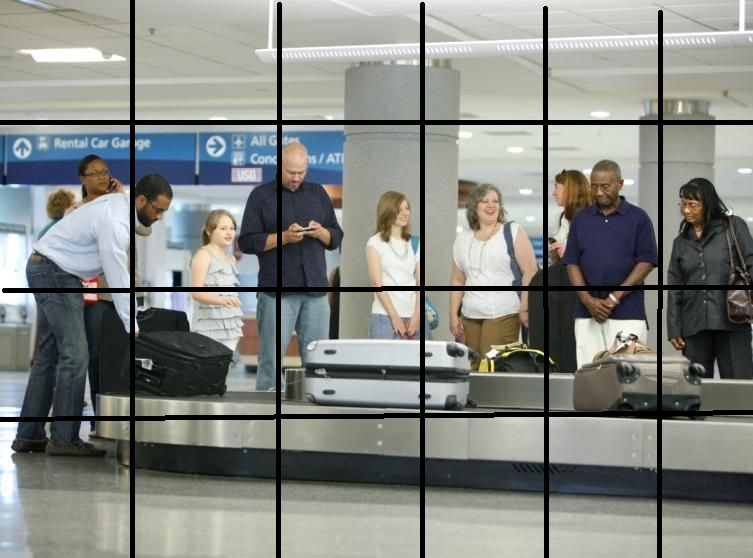
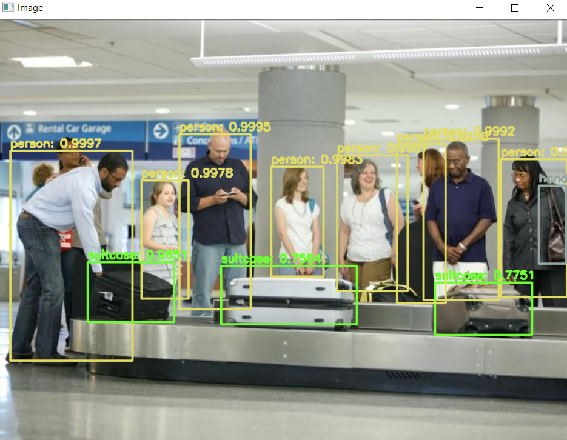
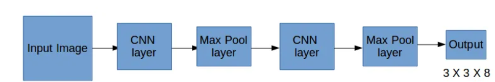
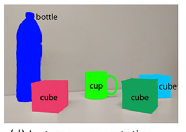
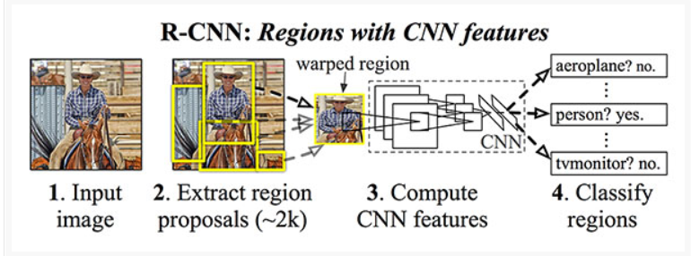
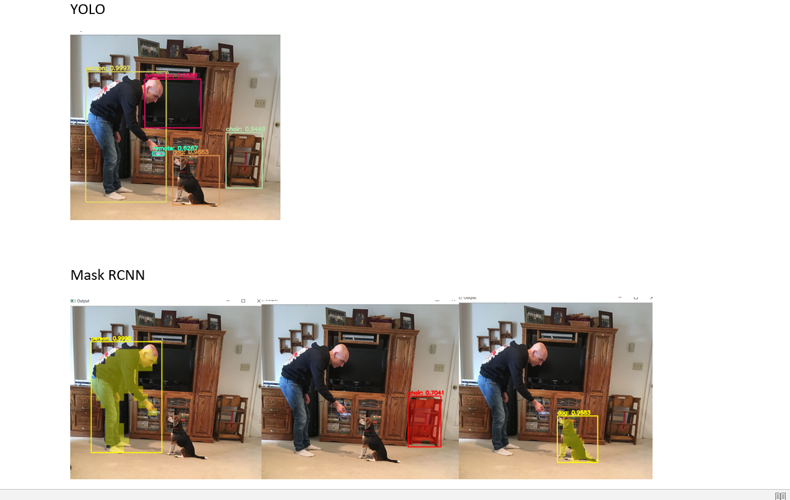
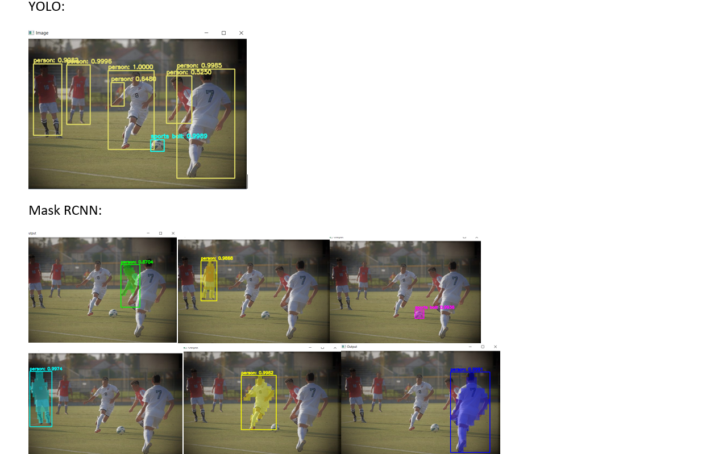

# Object-Detection

**OBJECT DETECTION USING YOLO AND MASK RCNN**

**YOLO(You only look once):**
1.  The name itself says that the image is processed or passed into the model only for once, unlike a traditional RCNN.
2.  This method takes an input image and divides that image into multiple grids. Each grid is responsible for predicting at least 5 bounding boxes.

  

3. Each grid is associated with 8X1 dimensional vector which has the probability of the presence of an object, dimension of the bounding box, class of the object.
4. Each object is assigned to one grid cell even if it doesn't fall under its respective cell completely. The model only looks for the midpoint of the object under a cell and labels that object to that particular cell.
4. Then it repeatedly does the above process for each grid cell and gives output as an 8X1 dimensional vector.
5. At the end of the process, all these  vectors are passed to some threshold function which determines actual objects and then outputs the image.

  

The whole model is based on a single network which multiple CNN layers in it and this network will run both forward and backward propagation:

  

**Mask R-CNN(Regional Convolutional Neural Networks):**
1.  Mask R-CNN gives information about what pixel belong to the object and background.
2. It's basically an algorithm based on Instance Segmentation, where it determines pixel-wise mask for every object present in the image.

  

3.  An input image is passed to the model and the model extracts regions which may potentially contain objects using selective search algorithm.
4.  By using transfer learning method, specifically, feature extraction model computes features for each extracted region using the pre-trained CNN. 
5. At last the extracted regions where an object is identified are passed to SVM classifier for final prediction of the class of the object which it belongs to.

  

**Parameters which I have tried:**
**Number of Objects:**

  

YOLO detects more images than Mask R-CNN.

**Quality of Image:**

  

YOLO is more effective than Mask R-CNN. But R-CNN is more conscious about what it is detecting.  
# Credits:
YOLO: https://www.pyimagesearch.com/2018/11/12/yolo-object-detection-with-opencv/  
Mask-RCNN: https://www.pyimagesearch.com/2018/11/19/mask-r-cnn-with-opencv/
# Mask RCNN repository coming soon....
