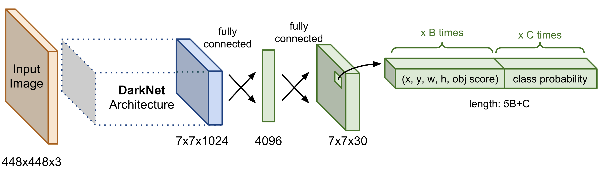

# Structure of the code files:

 **Note: Due cpu and memory constraints, yolov3-tiny has been used in the system.The architecture files are heavy to be uploaded on github,please click the [link](https://drive.google.com/drive/folders/1tDsQgcUoQw8hnxHRrLbb-nbhfMduEhyn?usp=sharing) to download yolov3 and yolov3-tiny weights and config file.**

1. ```main.py```: this file contains all the main code which runs to detect persons in the image.How function works and it's functionalities have been documented in that code file itself.

2. ```helper.py```: this file contains three helper functions. The purpose of making a helper function file for three is to maintain code readablity.

### How to Run:
```python
console:~$ main.py --videopath /path/to/the/video/file
# Above lines output a window which runs the application
```
**Output looks like this:**


3. The output window has four string on the top left corner.  
```Persons Detected: Total no of persons detected in each frame```  
```People at high risk: Total no of people who are not following social distancing.```  
```People at low risk: Total no of people who are somewhat following social distancing.```  
```People at no risk: Total no of people who are following social distancing.```  
**Hence based on these four paramters social distancing can be monitored**

# Structure of YOLO:
### Basic Yolo V3 architecture:
<p align="center">
  
</p>  

```1. The above yolov3 architecture takes an input of 448X448X3( used 416X416 CNN architecture).```  
```2. There is a darkenet-53 architecture in between and then it is followed by fully connected layer of 4096 nodes.```  
```3. Then the final layer unpacks the bounding boxes params, confidences and classes.```  

### YOLO V3 Tiny Architecture:
So instead of darknet-53, the below architecture has been used.  
<p align="center">
  
</p>  
  
#### Requirements:
1. OpenCV 4.1.2  
2. argparse  
3. numpy  

  

